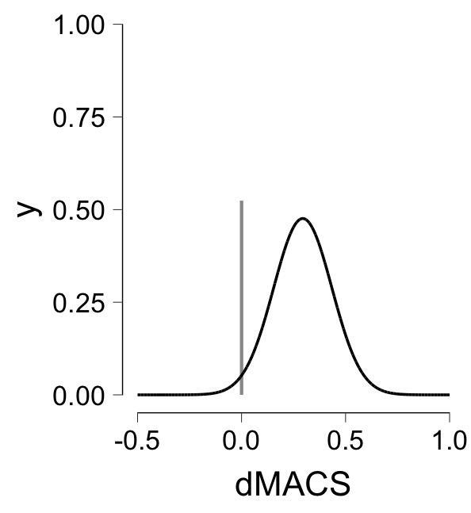

```{r libraries}
suppressWarnings(library(tidyverse))
suppressWarnings(library(gganimate))
suppressWarnings(library(transformr))
```

### Introduction

In this portfolio I am now going to animate a spike and slab graph to demonstrate how this graph updates with new information. This will be very similar to my previous portfolio except now I'm working with two priors (i.e., the spike and the slab).

### What does it look like?

It is a good idea to first look at what exactly we are trying to create.

{width="406"}

I should note that we are looking at currently is the posterior distribution of the spike-and-slab plot graph looks like. There is a prior that this graph shifts from.

### Prior Spike-and-Slab

```{r Prior Spike-and-Slab}
spike_prior <- tribble(~dMACS, ~Density,
                       0, 0,
                       0, 0.5)

x<-seq(-4,4, length.out = 1e4)
y<-dnorm(x)
y<-y/max(y)*(.5)
slab_prior <- tibble(dMACS = x, Density = y)

 ggplot() +
  geom_line(data = spike_prior, aes(x=dMACS,y=Density, color = "Spike"),
            alpha=0.5, linewidth = 1.5) + 
  geom_line(data = slab_prior, aes(x=dMACS,y=Density, color = "Slab"),
            alpha=0.5, linewidth = 1.5) + 
  labs (title = "Prior Spike and Slab",
        x = "dMACS",
        y = "Density",
        color = "") + 
  scale_color_manual(values = c("Slab" = "red", "Spike" = "blue" )) +
  xlim(-4,4)
```

You'll notice this is the same graph from portfolio 3.

### Posterior Spike-and-Slab

Now let's code the posterior spike-and-slab.

```{r post spike-and-slab}
spike_prior <- tribble(~dMACS, ~Density,
                       0, 0,
                       0, 0.6)

x<-seq(-4,4, length.out = 1e4)
y<-dnorm(x, mean = 2, sd = 0.5)
y<-y/max(y)*(.4)
slab_prior <- tibble(dMACS = x, Density = y)

 ggplot() +
  geom_line(data = spike_prior, aes(x=dMACS,y=Density, color = "Spike"),
            alpha=0.5, linewidth = 1.5) + 
  geom_line(data = slab_prior, aes(x=dMACS,y=Density, color = "Slab"),
            alpha=0.5, linewidth = 1.5) + 
  labs (title = "Prior Spike and Slab",
        x = "dMACS",
        y = "Density",
        color = "") + 
  scale_color_manual(values = c("Slab" = "red", "Spike" = "blue" )) +
  xlim(-4,4)
```

Perfect! You'll notice also how the spike and slab heights change from the prior. This is mean to represent their competing probabilities of being true (i.e., the probability of the null versus the alternative being true). This will also need to be animated.

Now let's create an animation that shifts the prior spike-and-slab graph to the posterior spike-and-slab graph.

### Animate

Using the same method we used in portfolio 7 we shall animate the shift from the prior to the posterior spike-and-slab graph.

```{r Animate}
a <- seq(0, 2, length = 100)
b <- seq(1, .5, length = 100)
c <- seq(.5,.4, length = 100)

prior_post_slab<- data.frame(x = 0, y = 0, frame = 0)
for (i in 1:100){
  x<-seq(-4,4, length.out = 1e4)
  y<-dnorm(x, a[i], b[i])
  y<-y/max(y)*(c[i]) # this will gradually decrease the height of slab as the frames increase
  dat <- tibble(x = x, y = y, frame = i)
  prior_post_slab <- bind_rows(prior_post_slab, dat)
}
prior_post_slab <- prior_post_slab[-1,]

spike.x <- rep(0,200)
a <- seq(.5,.6, length =100)
frame <- c(seq(1:100))

prior_post_spike <- data.frame(spike.y = 0, frame = 0)
for (i in 1:100){
  b <- 0
  c <- a[i] # this will gradually increase the height of the spike as the frames increase
  dat <- data.frame(spike.y = c(b,c), frame = i)
  prior_post_spike <- bind_rows(prior_post_spike, dat)
}
prior_post_spike <- prior_post_spike[-1,]
prior_post_spike <- bind_cols(spike.x = spike.x, prior_post_spike)


ggplot() + 
  geom_line(data = prior_post_slab,
            aes(x=x,y=y),alpha=0.5, 
            linewidth = 2, color = "#4169E1") +
  geom_line(data = prior_post_spike,
            aes(x = spike.x, y = spike.y), 
            alpha = 0.5, linewidth = 2, color = "red") +
  #Animation
  labs (title = "Amount of Prior Knowledge = {frame_time}%",
        x = "dMACS",
        y = "Density") + 
  transition_time(frame) + 
  ease_aes('linear') 
```

There we have it! Now of course it is possible that the height of the slab and spike could be reversed such that the height of slab increases and the height of the spike decreases with more prior information. However, for the purposes of this example we assume that with more information the spike becomes more probable and the slab becomes less probable.
